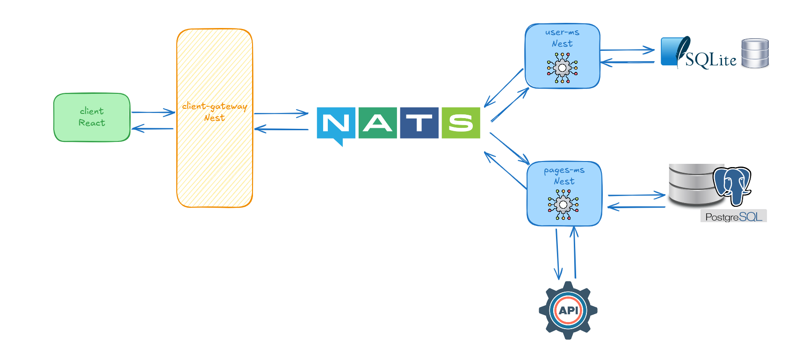

# Descripcion de utilizado
Se desarrolló un sistema basado en una arquitectura de microservicios con el objetivo de ofrecer una solución escalable y modular para la gestión y análisis de datos. El proyecto está compuesto por los siguientes elementos clave:

1- Frontend en React y Typescript: Se utilizó React para desarrollar la interfaz de usuario, brindando una experiencia interactiva, moderna y altamente responsiva para los usuarios finales.

2- API Gateway en NestJS: El gateway, implementado con NestJS, actúa como un punto central de entrada para las solicitudes, manejando la orquestación y comunicación eficiente entre los microservicios. Esta tecnología fue elegida por su robustez y soporte para TypeScript, lo que garantiza un desarrollo más estructurado y mantenible.

3- Servidor NATS: NATS se utilizó como sistema de mensajería asíncrona para facilitar la comunicación entre microservicios. Este enfoque asegura alta disponibilidad, entrega rápida de mensajes y desacoplamiento entre servicios.

4- Microservicio de Usuarios en NestJS: Este microservicio maneja gestión de usuarios. NestJS fue seleccionado por su arquitectura modular y su capacidad para integrarse fácilmente con herramientas modernas.

5- Microservicio de Procesamiento de Datos en Python (FastAPI):

 * Elección de Python y FastAPI: Python fue elegido debido a su potencia en el manejo de datos y la extensa biblioteca de herramientas disponibles, como Pandas, que facilita la manipulación y análisis de datos. FastAPI destaca por su rendimiento, simplicidad y soporte para OpenAPI, lo que facilita la integración con otros servicios.

 * Funcionalidades: Este microservicio es responsable de interactuar con APIs externas para extraer datos, almacenarlos en su forma bruta, procesarlos, archivarlos (física y lógicamente en bases de datos) y prepararlos para análisis posteriores. La inclusión de Pandas permite realizar operaciones avanzadas de procesamiento y limpieza de datos de manera eficiente.

# Docker Config

### Requisitos

Asegúrese de tener lo siguiente instalado en su sistema:
- [Docker](https://www.docker.com/get-started)
- [Docker Compose](https://docs.docker.com/compose/install/)

### Run and Build
`docker-compose up --build`